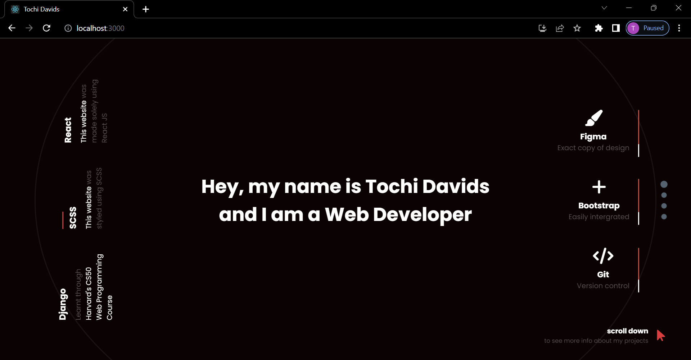

<!-- Please update value in the {}  -->

<h1 align="center">Portfolio</h1>

<div align="center">
  <h3>
    <a href="https://tochidavids.netlify.app">
      Live
    </a>
  </h3>
</div>

<!-- TABLE OF CONTENTS -->

## Table of Contents

-   [Overview](#overview)
    -   [Built With](#built-with)
-   [How to use](#how-to-use)
-   [Acknowledgements](#acknowledgements)
-   [Contact](#contact)

<!-- OVERVIEW -->

## Overview



### Built With

<!-- This section should list any major frameworks that you built your project using. Here are a few examples.-->

-   [React JS](https://reactjs.org/)
-   [SCSS](https://sass-lang.com/)

## How To Use

<!-- Example: -->

To clone and run this application, you'll need [Git](https://git-scm.com) and [Node.js](https://nodejs.org/en/download/) (which comes with [npm](http://npmjs.com)) installed on your computer. From your command line:

```bash
# Clone this repository
$ git clone https://github.com/tochidavids/Portfolio

# Install dependencies
$ npm install

# Run the app
$ npm start
```

## Acknowledgements

<!-- This section should list any articles or add-ons/plugins that helps you to complete the project. This is optional but it will help you in the future. For example: -->

-   [Font Awesome](https://fontawesome.com/)
-   [React Fullpage](https://reactjsexample.com/a-react-implementation-of-fullpage-js/)
-   [EmailJS](https://emailjs.com)
-   [Netlify](https://netlify.com/)
-   [Homepage Inspiration](https://cdn.dribbble.com/users/1665579/screenshots/11106956/media/ad7637ac30cc1f116ffaea3b970b4fa7.jpg)

## Contact

-   [Portfolio Website](https://tochidavids.netlify.app)
-   GitHub - [@tices0](https://github.com/tochidavids)
-   Email - tochidavids18@gmail.com
